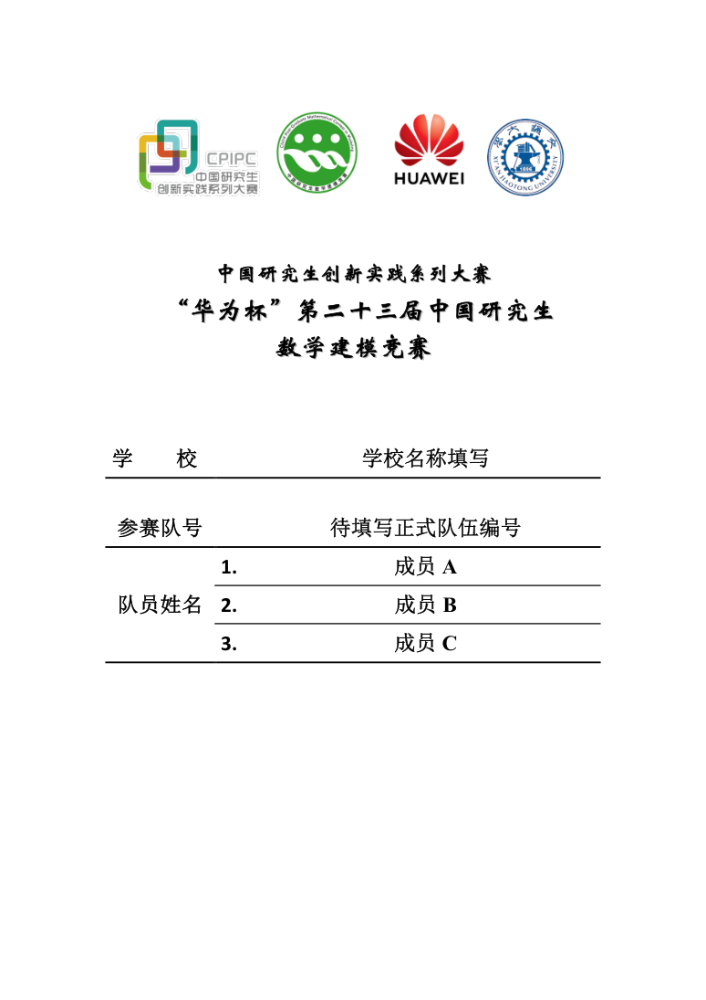
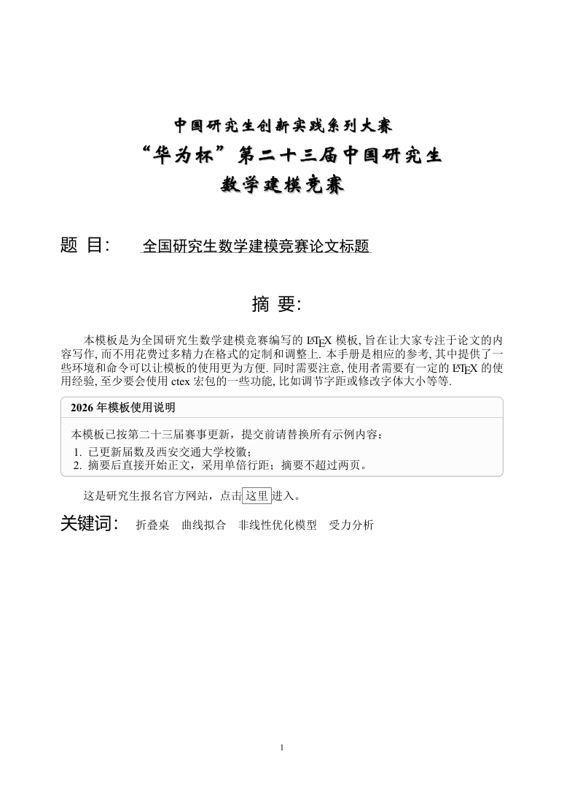

# 2026 华为杯研究生数学建模竞赛 LaTeX 模板

适用于“华为杯”第二十三届中国研究生数学建模竞赛，承办高校为西安交通大学。在已有 GMCMthesis 模板基础上更新，并对照 2026 年官方 Word 模板检查封面和摘要页。

> 本仓库是非官方 LaTeX 适配模板。参赛时请以组委会最新要求为准。示例中的学校、成员、队号、摘要与正文需要替换为自己的内容。

## 预览

| 封面 | 摘要页 |
| --- | --- |
|  |  |

- [常规示例 PDF](example.pdf)
- [彩色表格示例 PDF](example-color.pdf)
- [DOC 与 LaTeX 格式核对记录](reference/2026/格式核对.md)

## 编译

安装包含 XeLaTeX、latexmk、BibTeX 和中文支持的 TeX Live 或 MacTeX。在项目根目录执行：

```bash
latexmk -xelatex -interaction=nonstopmode -halt-on-error example.tex
latexmk -xelatex -interaction=nonstopmode -halt-on-error example-color.tex
```

也可以运行 `bash makefiles.sh`（macOS / Linux）或 `makefiles.bat`（Windows），一次编译两个示例。编译产物为 `example.pdf` 和 `example-color.pdf`。

项目已包含封面、标题与标签所需的 PDF 素材，正常编译无需 Microsoft Word 或 Python。请保留 `figures/` 目录，并从项目根目录运行编译命令。

### 字体

封面和摘要页固定字形已经嵌入 PDF 素材，包含原稿的华文新魏标题及阴影。正文根据系统选择字体；macOS 若安装 Microsoft Word，则优先使用其自带的 SimSun 和 SimHei。其他环境使用类文件中的字体回退，正文换行可能略有差异。

## 填写参赛信息

修改 `example.tex` 或 `example-color.tex` 中的以下字段：

```tex
\title{论文题目}
\baominghao{正式队伍编号}
\schoolname{学校名称}
\membera{成员一}
\memberb{成员二}
\memberc{成员三}
```

字段由类文件定位，无需添加手工水平空格。随后替换摘要、关键词、正文、参考文献及附录。示例摘要中的“模板使用说明”框也应删除。

## 2026 版调整

- 更新第二十三届赛事名称及西安交通大学校徽。
- 从官方 DOC 的 Microsoft Word 输出中提取封面和摘要页固定版式，保留原稿字形、图形、标签和表格线位置。
- 对齐页面尺寸、页边距和页脚位置；正文小四宋体、论文题目三号黑体、一级标题四号黑体。
- 使用单倍行距，摘要后直接进入正文；修复意外空白页及封面条件语句未闭合问题。
- 封面不显示页码，摘要从 1 开始连续编号。

固定版式已与本机 Word 导出基准进行图像与坐标比较。原 DOC 没有正文样段，因此验证范围不包括任意正文内容与 Word 的逐页分页一致性；关键词位置随摘要长度变化。原 DOC 的封面“0”和末尾空白页未复制。详见[核对记录](reference/2026/格式核对.md)。

## 目录

| 文件 | 用途 |
| --- | --- |
| `example.tex` / `example-color.tex` | 常规 / 彩色表格示例 |
| `gmcmthesis.cls` | 模板类文件 |
| `gmcm.bst` / `reference.bib` | 参考文献样式与示例文献 |
| `figures/` | 固定版式素材及示例插图 |
| `reference/2026/` | 官方格式文件、Word 导出基准和核对记录 |
| `scripts/extract_template_assets.py` | 从 Word 导出基准重新提取素材 |
| `scripts/verify_template_alignment.py` | 核对固定版式、字号与页码 |

维护脚本使用 Python、PyMuPDF、NumPy 和 Pillow；这些依赖仅用于素材维护与核对，不参与日常 LaTeX 编译。

```bash
python -m pip install pymupdf numpy pillow
python scripts/verify_template_alignment.py
```

## 来源

本项目基于原有 GMCMthesis 模板修改，保留类文件中的 latexstudio.net、andy123t 及相关贡献说明。官方文件及赛事、学校、企业标识的权利归各自权利人所有。

- [2026 年官方论文格式规范](https://cpipc.acge.org.cn/sysFile/downFile.do?fileId=97a93e3a9e074738aea95eea986508f2)
- [2026 年官方论文模板](https://cpipc.acge.org.cn/sysFile/downFile.do?fileId=a730b312331e492baad17b248bad6b51)
- [中国研究生创新实践系列大赛官网](https://cpipc.acge.org.cn/)
